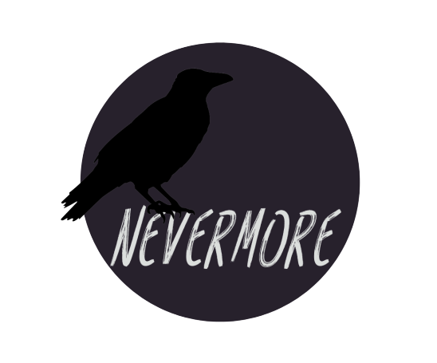
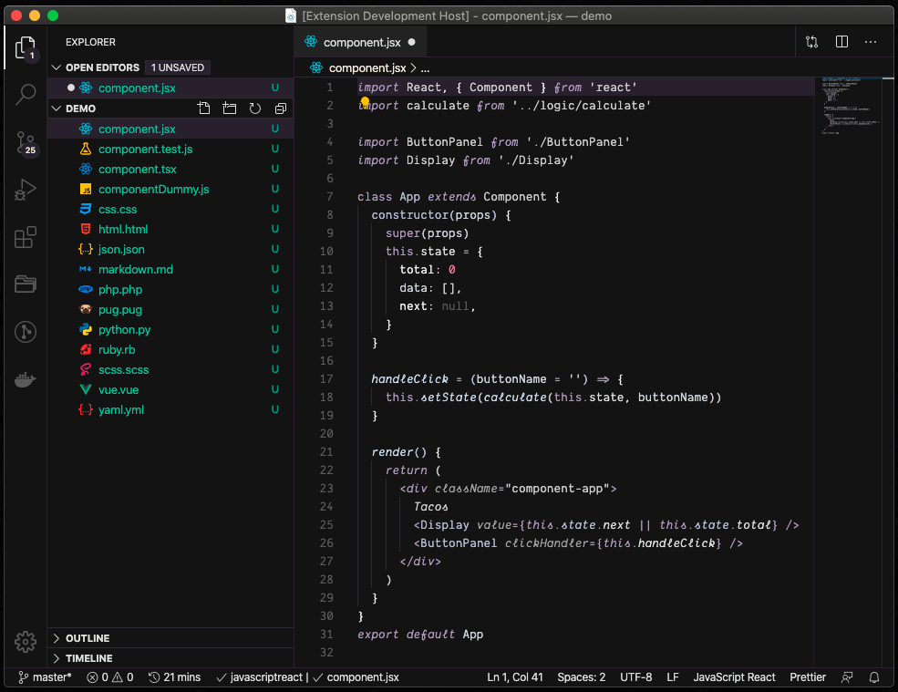

# Nevermore



> A dark theme, and nothing more.

Nevermore is a dark theme which uses subtle color variations to be pleasant to the eyes.

## Pre



## Installation

1. Install [VS Code](https://code.visualstudio.com/)
2. Launch VS Code
3. Choose **Extensions** from menu
4. Search for `nevermore`
5. Click **Install** to install it
6. Click **Reload** to reload VS Code
7. From the menu bar click: Code > Preferences > Color Theme > **Nevermore**

### Disable Italics

If you wish to disable italics, there is now a no-italic theme available. You will have access to both, select **Nevermore No Italics** as your color theme.

## Preferences

The font used in the preview is [Dank Mono](https://dank.sh/). If you wish a free alternative with support for font ligatures check:
- [Fira Code](https://github.com/tonsky/FiraCode)
- [JetBrains Mono](https://www.jetbrains.com/lp/mono/)

To activate font ligatures in the editor use the following settings:

```json
  "editor.fontFamily": "Dank Mono", // set to your desired font-family
  "editor.fontLigatures": true,
```

## Issues

This is my first adventure in creating a VS Code theme, so you're likely to find some issues, please feel free to [file an issue](https://github.com/cassiocardoso/nevermore-theme/issues?q=is%3Aissue+is%3Aopen+sort%3Aupdated-desc).

## Inspiration

I was inspired by the awesome work of Sarah Drasner in the [Night Owl](https://github.com/sdras/night-owl-vscode-theme) theme. If you're interested in knowing more about the process of creating your own VS Code theme, check her post on CSS Tricks: [Creating a VS Code Theme](https://css-tricks.com/creating-a-vs-code-theme/)
